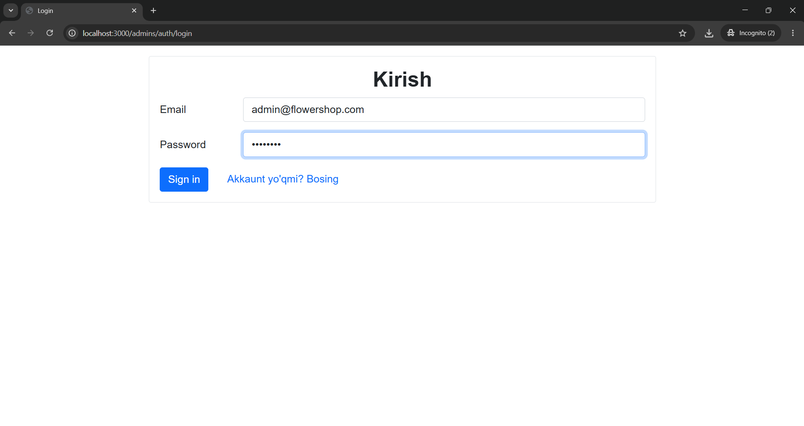
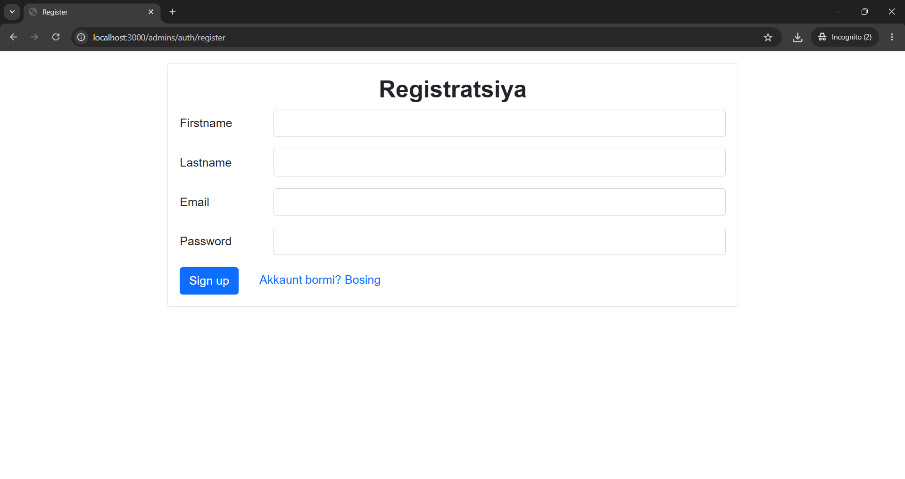
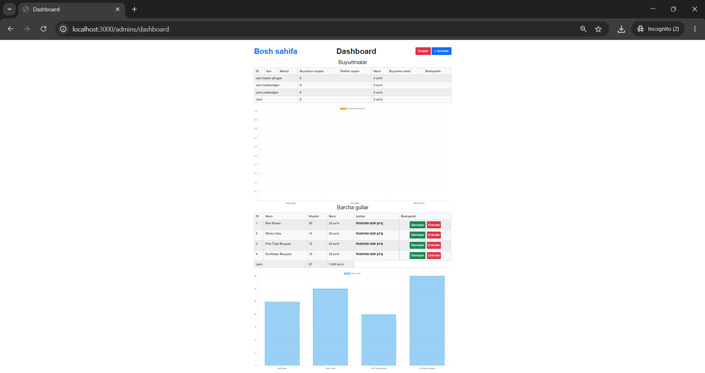
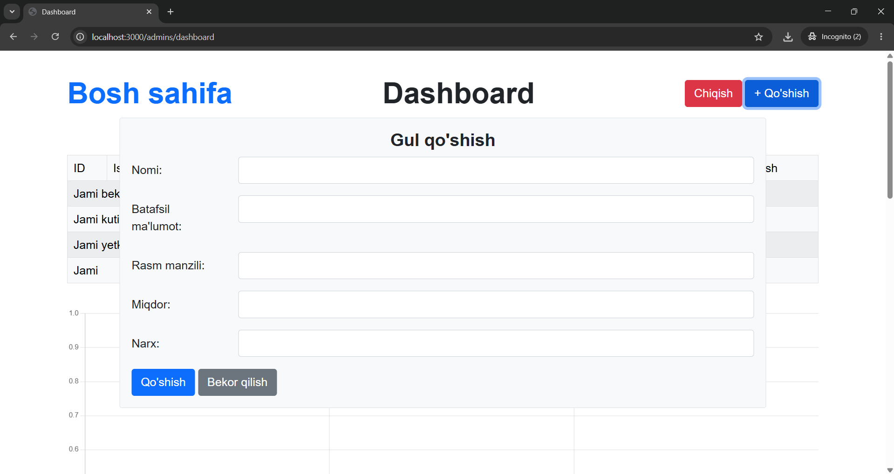
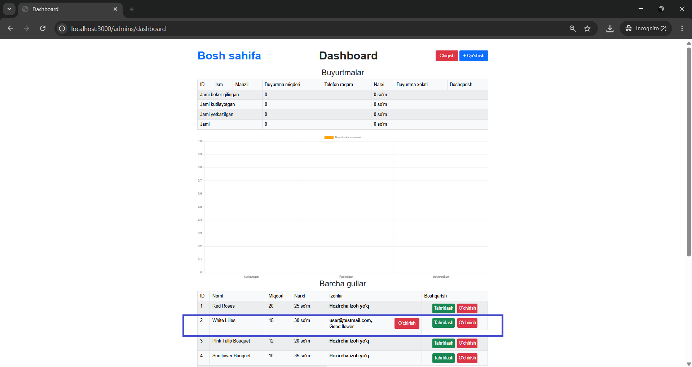
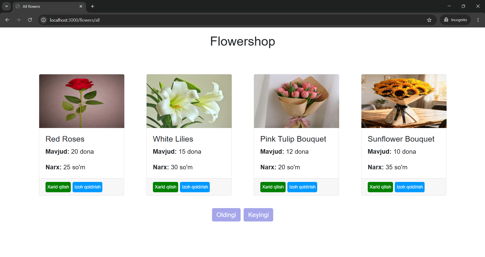
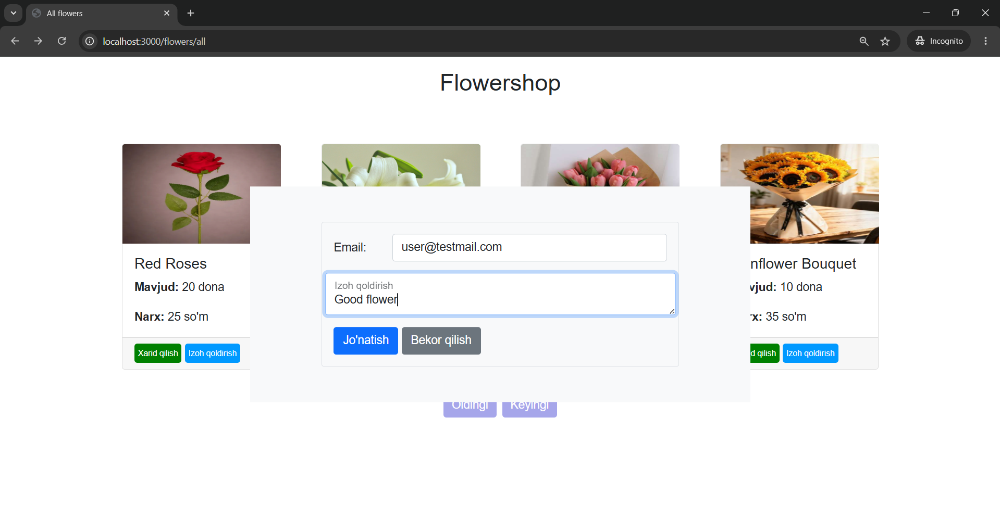
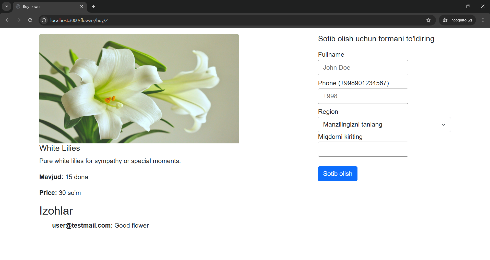

# FlowerShop

Simple Node.js + Express + Sequelize (Postgres) demo application for managing flowers, reservations and comments.
## Features
- List and browse flowers
- Admin dashboard to create / edit / delete flowers, manage reservations and comments
- Reservations and comments linked to flowers
- Seed script to populate default admin and sample flowers

## User Stories

### Story 01: Login
The admin can log in using valid credentials to access the dashboard.



### Story 02: Signup
A new admin can register for an account before signing in.



### Story 03: Dashboard
After login, the admin can view the dashboard with flower, reservation, and comment management options.



### Story 04: Add Flower
The admin can add a new flower to the catalog from the dashboard.



### Story 05: View Comments on Dashboard
The admin can review customer comments directly from the dashboard.



### Story 06: Browse Flowers
A visitor can browse available flowers on the public listing page.



### Story 07: Buy Flower
A visitor can select a flower and proceed to buy it.


### Story 08: Add Comment
A visitor can leave a comment on a flower detail page.



### Story 09: See Comments on Flower
A visitor can view comments on the flower detail page.



## Prerequisites
- Node.js (16+ recommended)
- PostgreSQL (create a database for the app)

## Environment
Copy `.env.example` to `.env` and fill in values:

- DB_NAME: Postgres database name (e.g. `flowershop`)
- DB_USER: Postgres user (e.g. `postgres`)
- DB_PASSWORD: Postgres password
- SESSION_SECRET: session secret for express-session

See `.env.example` for the template.

## Install

```bash
npm install
```

## Database
Create the configured Postgres database (matching `DB_NAME` in `.env`). The app uses Sequelize and will auto-sync schemas.

## Seed data
Run the seeder to create a default admin and sample flowers:

```bash
npm run seed
```

The seeder is implemented in `seed.js` and also runs on server startup; it will create a default admin (`admin@flowershop.com`) and several sample flowers if they do not already exist.

## Run

Start the app in development mode:

```bash
npm run dev
```

Or start normally:

```bash
npm start
```

App will be available on `http://localhost:3000` by default (or the port set in `PORT`).

## Useful Scripts

- `npm run dev` — start with `nodemon`
- `npm run seed` — run the seed script (one-off)

## Project structure

- `server.js` — application entry
- `seed.js` — seed script (default data)
- `models/` — Sequelize models
- `controllers/` — request handlers
- `routes/` — Express routes
- `views/` — Handlebars templates
- `public/` — static assets (css/js)

## Notes & Troubleshooting

- If Sequelize cannot connect, verify Postgres is running and `.env` variables are correct.
- The app relies on Sequelize enums for `status` fields; altering those may require manual DB updates.
- Image URLs in seed data use external URLs; if images don't load, check network access or replace the `imageUrl` values in `seed.js`.

If you want I can add a `db:reset` script that drops and re-creates the database tables before seeding.
